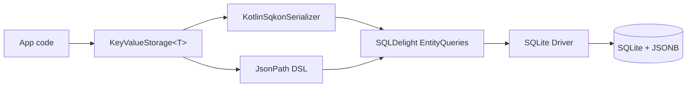

# Architecture

Sqkon takes typed Kotlin objects, runs them through `kotlinx.serialization` to JSON,
and stores them as JSONB blobs in a single SQLite table. Reads and writes go through
SQLDelight, which gives us type-safe SQL, automatic Flow invalidation, and a single
driver abstraction across Android and JVM. Queries built with the `JsonPath` DSL
compile down to `json_extract(value, '$.field')` predicates — pushing all filtering
into SQLite's query planner instead of materializing rows in Kotlin.

## Components

- **`Sqkon`** — the entry point. Holds the SQLDelight queries, a serializer, a
  `CoroutineScope`, and read/write dispatchers. Use `sqkon.keyValueStorage<T>(name)`
  to spawn typed stores.
- **`KeyValueStorage<T>`** — the per-type façade. Exposes `insert`, `update`,
  `upsert`, `select`, `selectByKey`, `selectByKeys`, paging sources, and TTL
  helpers. Every read returns a `Flow`.
- **`KotlinSqkonSerializer`** — wraps `kotlinx.serialization.json.Json` with sane
  defaults. You can pass your own `Json` instance to the `Sqkon` constructor.
- **`JsonPath` DSL** — turns Kotlin property references and operators (`eq`, `neq`,
  `inList`, `notInList`, `like`, `gt`, `lt`, plus `and`, `or`, `not`) into
  parameterized `WHERE` fragments backed by `json_extract`.
- **`EntityQueries` / `MetadataQueries`** — generated and hand-written SQLDelight
  queries against the two tables described below.
- **SQLite driver** — `androidx.sqlite` on both platforms. JVM uses an in-process
  bundle; Android uses the system SQLite via the AndroidX driver.

## Lifecycle of an insert

1. Caller invokes `storage.insert(key, value, expiresAt = ...)`.
2. The serializer encodes `T` to a JSON byte array using the configured `Json`
   instance.
3. SQLDelight runs an `INSERT` (or no-op if `ignoreIfExists = true` and the row
   exists) inside a transaction.
4. SQLite stores the row with `entity_name`, `entity_key`, `value` (JSONB),
   `added_at`, `updated_at`, optional `expires_at`, and `write_at`.
5. SQLDelight emits a notification for the affected query keys.
6. Any active `select(...)` Flows re-execute their underlying query.
7. Consumers see a fresh emission with the new row included.

## Lifecycle of a query

1. Caller composes a `Where<T>` — for example,
   `Merchant::category eq "Food" and Merchant::name like "Chi%"`.
2. The DSL compiles each operator to a SQL fragment using
   `json_extract(value, '$.field') = ?` (or `LIKE`, `IN`, `>`, `<`, `IS NOT`, etc.)
   with parameter placeholders.
3. SQLDelight runs the parameterized query against SQLite. Filtering happens inside
   the database — Kotlin never sees rows that don't match.
4. Returned blobs are deserialized back to `T` on the read dispatcher.
5. The Flow keeps observing; subsequent writes that touch the same query trigger
   re-emission.

## Why JSONB?

- **One physical table for every type.** Adding a new `@Serializable` data class
  requires zero schema changes and zero migrations — just call
  `keyValueStorage<NewType>("name")`.
- **Filtering pushes into SQLite's planner.** `json_extract` is a native SQLite
  function. Predicates execute alongside index scans and key lookups, not in app
  code.
- **Indexes can target JSON paths.** SQLite supports expression indexes like
  `CREATE INDEX ON entity (json_extract(value, '$.userId'))` for hot query paths.

## Schema

Sqkon uses two tables. The full SQLDelight definitions live at:

- [`library/src/commonMain/sqldelight/com/mercury/sqkon/db/entity.sq`](https://github.com/MercuryTechnologies/sqkon/blob/main/library/src/commonMain/sqldelight/com/mercury/sqkon/db/entity.sq)
- [`library/src/commonMain/sqldelight/com/mercury/sqkon/db/metadata.sq`](https://github.com/MercuryTechnologies/sqkon/blob/main/library/src/commonMain/sqldelight/com/mercury/sqkon/db/metadata.sq)

### `entity`

The single table that holds every value you store. Composite primary key is
`(entity_name, entity_key)` — `entity_name` is the namespace you pass to
`keyValueStorage<T>(name)`, and `entity_key` is the per-row key.

| Column        | Type    | Notes                                          |
|---------------|---------|------------------------------------------------|
| `entity_name` | TEXT    | Store name; part of the primary key.           |
| `entity_key`  | TEXT    | Per-row key; part of the primary key.          |
| `value`       | BLOB    | JSONB-encoded payload.                         |
| `added_at`    | INTEGER | UTC epoch millis; set on insert.               |
| `updated_at`  | INTEGER | UTC epoch millis; bumped on update.            |
| `expires_at`  | INTEGER | Optional UTC epoch millis; powers TTL queries. |
| `write_at`    | INTEGER | UTC epoch millis of last write.                |
| `read_at`     | INTEGER | UTC epoch millis of last observed read.        |

Indexes:

- `idx_entity_read_at` on `read_at`
- `idx_entity_write_at` on `write_at`
- `idx_entity_expires_at` on `expires_at`

### `metadata`

A small per-store table tracking the last read and write times across an entire
store. Useful for cache freshness checks and for purging stale entries.

| Column        | Type    | Notes                                |
|---------------|---------|--------------------------------------|
| `entity_name` | TEXT    | Primary key; one row per store.      |
| `lastReadAt`  | INTEGER | Mapped to `kotlinx.datetime.Instant`.|
| `lastWriteAt` | INTEGER | Mapped to `kotlinx.datetime.Instant`.|

{: .highlight }
> Sqkon never sets `generateAsync = true` on SQLDelight — the async driver doesn't
> play well with multithreaded JVM hosts. Coroutines and dispatchers handle
> concurrency instead.
