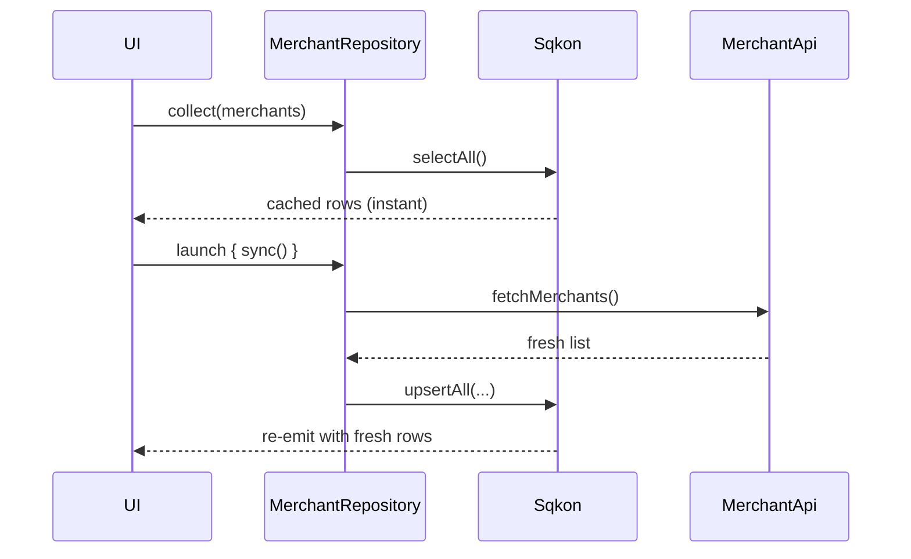

# Offline-first sync

The offline-first pattern is simple in principle: the UI only ever reads from
the local store, and a background job keeps the local store in sync with the
network. Sqkon makes the local side trivial — every read is a `Flow` that
re-emits whenever a write commits, so the UI updates itself the moment your
sync job lands new data.

## The data class

```kotlin
import kotlinx.serialization.Serializable

@Serializable
data class Merchant(
    val id: String,
    val name: String,
    val category: String,
)
```

## The repository

```kotlin
import com.mercury.sqkon.db.KeyValueStorage
import com.mercury.sqkon.db.OrderBy
import kotlinx.coroutines.flow.Flow

class MerchantRepository(
    private val storage: KeyValueStorage<Merchant>,
    private val api: MerchantApi,
) {
    /** Always reads from the local store. UI subscribes here. */
    val merchants: Flow<List<Merchant>> = storage.selectAll(
        orderBy = listOf(OrderBy(Merchant::name))
    )

    /** Pull from the network and persist. Wrapped in a single transaction. */
    suspend fun sync() {
        val remote = api.fetchMerchants() // List<Merchant>
        storage.upsertAll(remote.associateBy { it.id })
    }
}
```

`upsertAll` runs inside a single transaction — readers of `merchants` see one
emission with the full updated list, not 200 emissions as items trickle in.
That's also why you don't need to debounce the UI side.

## The lifecycle



## In a ViewModel

```kotlin
class MerchantViewModel(
    private val repo: MerchantRepository,
) : ViewModel() {

    val merchants: StateFlow<List<Merchant>> = repo.merchants
        .stateIn(viewModelScope, SharingStarted.WhileSubscribed(5_000), emptyList())

    init {
        viewModelScope.launch { repo.sync() }
    }

    fun refresh() = viewModelScope.launch { repo.sync() }
}
```

The UI can render `merchants` on the very first frame — if anything is in the
store from a previous session, it shows up before `sync()` finishes. When the
network call lands, the list updates in place.

{: .note }
`SharingStarted.WhileSubscribed(5_000)` keeps the underlying SQL subscription
warm for 5 seconds across config changes. On rotation, you don't re-query.

## Conflict resolution

`upsert` is last-write-wins by row. That's the right default for read-mostly
caches: the server is the source of truth, the local copy is a mirror.

For workflows where the user can edit local rows while the server is also
updating them, last-write-wins isn't enough. The pattern that scales:

1. Keep a second store (`pending-edits`) keyed by entity id, storing only the
   user's unsynced changes.
2. The UI flow merges the local row with any pending edit:
   ```kotlin
   val merged: Flow<List<Merchant>> = combine(
       storage.selectAll(),
       pendingEdits.selectAll(),
   ) { server, edits ->
       val edited = edits.associateBy { it.id }
       server.map { edited[it.id] ?: it }
   }
   ```
3. When the network sync of an edit succeeds, delete it from `pending-edits`.

{: .warning }
Don't try to merge three-way conflicts inside `upsertAll`. Sqkon's writes are
fire-and-forget once the transaction commits — by the time you'd be checking
"did this row change since I last read?", another writer may already have
clobbered the answer. Keep edit intent in its own store.

## Where to go next

- [Transactions guide]({{ '/guides/transactions/' | relative_url }}) — when
  emissions are batched vs. when they aren't.
- [Caching API responses]({{ '/examples/caching-api-responses/' | relative_url }})
  — for read-only endpoints that just need TTL eviction.
