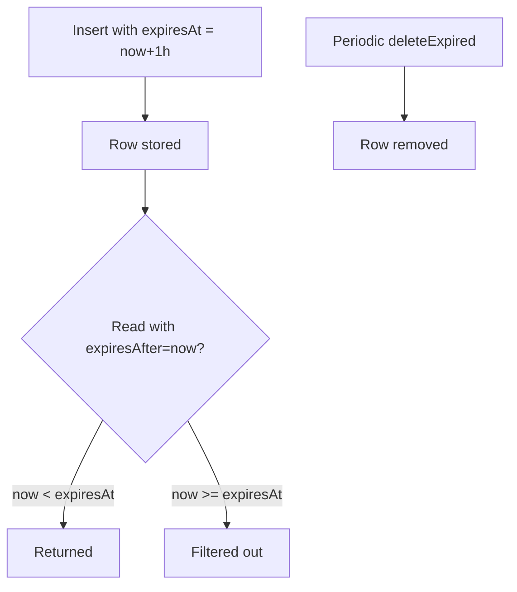

# Expiry / TTL
{: .no_toc }

Every Sqkon row carries an optional `expires_at` timestamp. The library never
deletes expired rows for you — you decide when to filter them out on read and
when to purge them. That separation keeps cache semantics flexible: a row can
be "expired but still useful as fallback" until you say otherwise.

1. TOC
{:toc}

## Setting expiry

Pass `expiresAt: Instant?` to any write. We recommend computing it from
`Clock.System.now()` plus a `kotlin.time.Duration`:

```kotlin
import kotlin.time.Clock
import kotlin.time.Duration.Companion.hours

merchants.insert(
    key = "m_1",
    value = Merchant(id = "m_1", name = "Chipotle", category = "Food"),
    expiresAt = Clock.System.now() + 1.hours,
)

// Same parameter on update / upsert / insertAll / updateAll / upsertAll
merchants.upsert("m_1", merchant, expiresAt = Clock.System.now() + 24.hours)
merchants.insertAll(batch, expiresAt = Clock.System.now() + 5.minutes)
```

Omitting `expiresAt` (or passing `null`) stores the row with no expiry.

## Filtering on read

Reads do **not** filter expired rows by default. Pass `expiresAfter =
Clock.System.now()` to skip rows whose `expires_at` is in the past:

```kotlin
val live = merchants.selectAll(expiresAfter = Clock.System.now()).first()
val liveFood = merchants.select(
    where = Merchant::category eq "Food",
    expiresAfter = Clock.System.now(),
).first()

// Counts respect the same filter
val livingCount = merchants.count(expiresAfter = Clock.System.now()).first()
```

The same parameter exists on `selectByKeys`, `select`, `selectResult`,
`selectPagingSource`, and `selectKeysetPagingSource`.

{: .note }
Rows with `expires_at = NULL` are always returned regardless of `expiresAfter`.
Use expiry only for entries that should age out — not as a "soft delete".

### Lifecycle



## Cleanup with `deleteExpired`

Filtering on read keeps expired rows on disk. To free space, purge them:

```kotlin
// Purge everything in this store with expires_at < now.
merchants.deleteExpired()                                  // defaults to Clock.System.now()
merchants.deleteExpired(expiresAfter = Clock.System.now())
```

Good places to schedule it:

- **App startup** — fire-and-forget on a background dispatcher.
- **Android `WorkManager` periodic** — a daily job for caches that don't see
  steady writes.
- **After a sync** — call `deleteExpired()` after a `RemoteMediator` populates
  fresh data, so old generations don't linger.

## Stale data with `deleteStale`

Different from expiry: `deleteStale` works off `read_at` and `write_at`
timestamps Sqkon maintains automatically on every read/write. Use it for
LRU-style eviction — drop rows nobody has touched recently — even when those
rows have no `expires_at`.

```kotlin
import kotlin.time.Duration.Companion.days

// Delete rows not read AND not written in the last 24 hours
merchants.deleteStale(
    writeInstant = Clock.System.now() - 1.days,
    readInstant = Clock.System.now() - 1.days,
)

// Either parameter can be null to skip that condition
merchants.deleteStale(writeInstant = Clock.System.now() - 7.days, readInstant = null)
```

Default values for both parameters are `Clock.System.now()` — without
arguments, the call deletes rows untouched as of *right now* (effectively
everything not currently being read or written, useful in tests but rarely in
production). Always pass an explicit threshold.

## Verbatim test snippet

From `library/src/commonTest/kotlin/com/mercury/sqkon/db/KeyValueStorageExpiresTest.kt`:

```kotlin
@Test
fun deleteExpired() = runTest {
    val now = Clock.System.now()
    val expected = (0..10).map { TestObject() }.associateBy { it.id }
    testObjectStorage.insertAll(expected, expiresAt = now.minus(1.milliseconds))
    val actual = testObjectStorage.selectAll().first() // all results
    assertEquals(expected.size, actual.size)

    testObjectStorage.deleteExpired(expiresAfter = now)
    // No expires to return everything
    val actualAfterDelete = testObjectStorage.selectAll().first()
    assertEquals(0, actualAfterDelete.size)
}
```

Two things to notice:

- `selectAll()` *with no `expiresAfter`* still returns the expired rows — they
  exist on disk until purged.
- After `deleteExpired(now)` they're gone; the next `selectAll()` is empty.

## See also

- [Flow]({{ '/guides/flow/' | relative_url }}) — `expiresAfter` on a Flow re-evaluates on every emission, but does not re-emit when wall-clock crosses an `expires_at`. Snapshot at the moment of read.
- [Performance]({{ '/guides/performance/' | relative_url }}) — `expires_at` is indexed; `expiresAfter` filters cheaply.
- Source: `library/src/commonMain/kotlin/com/mercury/sqkon/db/KeyValueStorage.kt`
  (`deleteExpired`, `deleteStale`).
