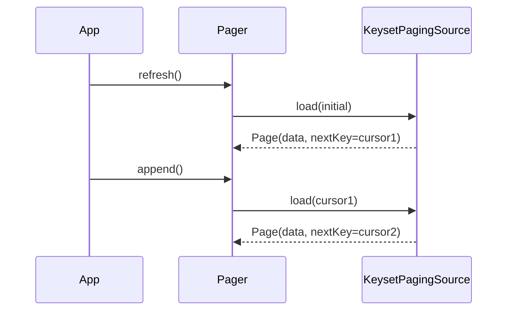
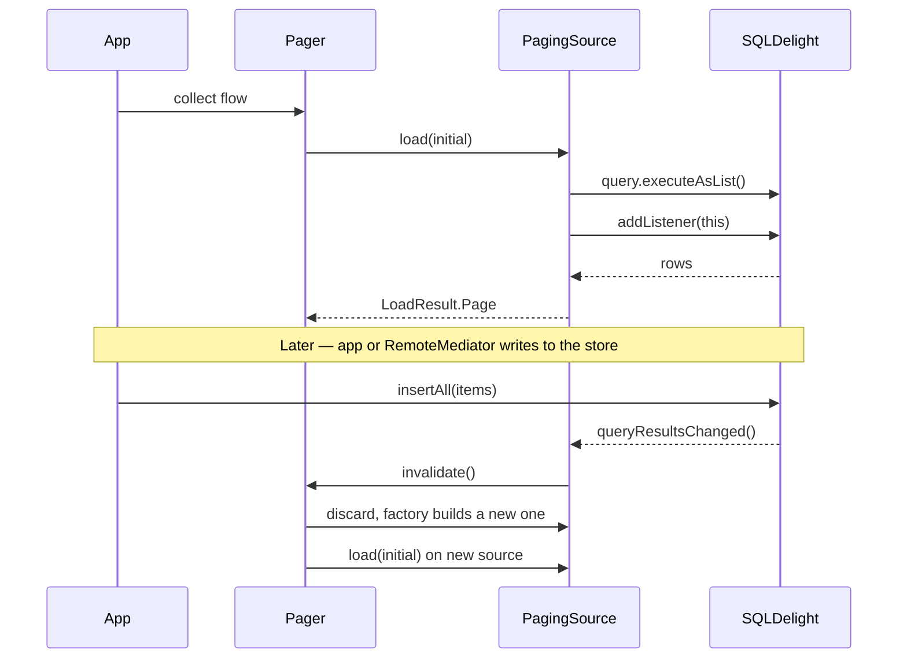

# Paging
{: .no_toc }

Sqkon plugs into [AndroidX Paging 3](https://developer.android.com/topic/libraries/architecture/paging/v3-overview).
Your `KeyValueStorage<T>` exposes two `PagingSource` factories — pick one and
hand it to a `Pager`.

1. TOC
{:toc}

## TL;DR

| | `selectPagingSource` (offset) | `selectKeysetPagingSource` (keyset) |
|---|---|---|
| **Key type** | `Int` (row offset) | `String` (entity key at page boundary) |
| **First-page cost** | O(pageSize) | O(pageSize) for the load + O(n) once for boundary precompute |
| **Late-page cost** | O(offset + pageSize) — grows with depth | O(log n) — same regardless of depth |
| **Random page jumps** | yes | no (`jumpingSupported = false`) |
| **Best for** | Small/medium datasets, random access | Large datasets, deep scrolling, `RemoteMediator` |

If you don't know which to pick, jump to [Choosing](#choosing).

## Why paging?

Loading 50 000 rows into memory at once burns RAM, blocks the UI thread on
deserialization, and wastes work — most users only look at the first few
screens. Paging 3 loads pages on demand and discards old ones as the user
scrolls. Sqkon's job is to give Paging 3 a `PagingSource` that reads from your
local SQLite store.

## Offset paging — `selectPagingSource`

**Mental model.** "Give me `pageSize` rows starting at row `N`." It's
`SELECT … LIMIT N OFFSET M` — the SQL you already know.

```
Rows in table:  [r0][r1][r2][r3][r4][r5][r6][r7][r8][r9][r10]...
                              ^               ^
                              offset = 4      ... limit = 3 -> returns [r4][r5][r6]
```

**Cost.** SQLite walks past `offset` rows before returning anything. Page 1 is
cheap, page 100 is not — the engine still has to skip the first 99 × `pageSize`
rows. Fine up to a few thousand items; degrades on tens of thousands.

**Code.**

```kotlin
val pager = Pager(
    config = PagingConfig(pageSize = 20, prefetchDistance = 5),
    pagingSourceFactory = {
        merchants.selectPagingSource(
            where = Merchant::category eq "Food",
            orderBy = listOf(OrderBy(Merchant::name, OrderDirection.ASC)),
        )
    }
)

// In a ViewModel:
val merchantsPaging: Flow<PagingData<Merchant>> = pager.flow.cachedIn(viewModelScope)
```

**Use it when** the dataset is small/medium, or you need users to deep-link
into a specific page (for example "page 7" of an admin table).

## Keyset paging — `selectKeysetPagingSource`

**Mental model.** "Compute the entity-key at every page boundary up front, then
look up rows by key for each page." Each page is an indexed range scan — no
skipping.

```
Sorted rows:    [a1][a2][a3][b1][b2][b3][c1][c2][c3][d1]...
Boundaries:      ^           ^           ^           ^
                 k0          k1          k2          k3

load(key = k1) -> SELECT ... WHERE entity_key >= k1 AND entity_key < k2
              -> returns [b1][b2][b3]
```

**Cost.** Boundaries are computed once when the `PagingSource` is created (a
single window-function query). Each subsequent page is an indexed range scan —
same cost on page 1 as on page 1000.

**Code.** Same shape as offset paging, one method name different:

```kotlin
val pager = Pager(
    config = PagingConfig(pageSize = 20, prefetchDistance = 5),
    pagingSourceFactory = {
        merchants.selectKeysetPagingSource(
            pageSize = 20,                                    // must match PagingConfig.pageSize
            where = Merchant::category eq "Food",
            orderBy = listOf(OrderBy(Merchant::name, OrderDirection.ASC)),
        )
    }
)

val merchantsPaging: Flow<PagingData<Merchant>> = pager.flow.cachedIn(viewModelScope)
```

### Cursor lifecycle

Each load takes the previous page's last entity-key as the cursor for the
next page:



### Limitations

- `jumpingSupported = false`. Paging 3 cannot scroll-jump to an arbitrary
  position — pages are loaded sequentially from the start (or from a refresh
  key).
- The `pageSize` argument **must equal** `PagingConfig.pageSize`. They're
  independent and a mismatch throws boundary math off.

**Use it when** the dataset is large, infinite-scroll, or backed by a
`RemoteMediator`.

## How invalidation works

Both paging sources observe the underlying SQLite table. When a write lands,
the source invalidates and Paging 3 builds a fresh one with up-to-date data —
no manual refresh needed.



{: .important }
The listener attaches the first time `load()` runs a query, **including the
empty-result case**. Keyset paging registers the listener on the boundaries
query when the store starts empty, so an empty-then-populated transition
(typical when a `RemoteMediator` does the first network fetch) still triggers
an invalidation.

## RemoteMediator pattern

Sqkon is the local cache and single source of truth. `RemoteMediator` writes
into the store; the `PagingSource` reads from it and invalidates when writes
land. Skeleton:

```kotlin
class MerchantsMediator(
    private val api: MerchantsApi,
    private val store: KeyValueStorage<Merchant>,
) : RemoteMediator<String, Merchant>() {
    override suspend fun load(
        loadType: LoadType,
        state: PagingState<String, Merchant>,
    ): MediatorResult = try {
        val cursor = state.lastItemOrNull()?.id
        val page = api.fetch(cursor = cursor)
        store.insertAll(page.items.associateBy { it.id })   // triggers PagingSource invalidation
        MediatorResult.Success(endOfPaginationReached = page.next == null)
    } catch (e: IOException) {
        MediatorResult.Error(e)
    }
}
```

Wire it into `Pager(remoteMediator = MerchantsMediator(api, store), pagingSourceFactory = { … })`
and either paging source works.

## Compose integration

Add the Compose paging artifact:

```kotlin
// build.gradle.kts
dependencies {
    implementation("androidx.paging:paging-compose:<version>")
}
```

Then collect the pager flow as `LazyPagingItems` and feed it to a `LazyColumn`:

```kotlin
class MerchantsViewModel(
    private val merchants: KeyValueStorage<Merchant>,
) : ViewModel() {
    val pager: Flow<PagingData<Merchant>> = Pager(
        config = PagingConfig(pageSize = 20),
        pagingSourceFactory = { merchants.selectKeysetPagingSource(pageSize = 20) },
    ).flow.cachedIn(viewModelScope)
}

@Composable
fun MerchantsScreen(viewModel: MerchantsViewModel) {
    val items = viewModel.pager.collectAsLazyPagingItems()
    LazyColumn {
        items(items.itemCount) { index ->
            items[index]?.let { MerchantRow(it) }
        }
    }
}
```

`cachedIn(viewModelScope)` is required — without it the pager re-fetches on
every recomposition.

## Choosing

1. **Need random page jumps (deep-link to "page 7")?** -> offset.
2. **Scrolling thousands of rows, or backing this with `RemoteMediator`?** -> keyset.
3. **Otherwise** -> either works; offset is simpler — start there and switch if
   profiling shows late-page cost.

## Pitfalls

- **`pageSize` mismatch.** `PagingConfig.pageSize` and
  `selectKeysetPagingSource(pageSize = …)` are passed independently — set them
  to the same value or boundary math drifts.
- **`orderBy` needs a tiebreaker** when the column has duplicates. Sqkon's
  keyset SQL automatically appends a tiebreaker on `entity_key`; if you write
  your own SQL elsewhere, do the same.
- **Don't share a `PagingSource` across factories.** Paging 3 owns the
  lifecycle — let `pagingSourceFactory = { … }` build a fresh one each time. A
  `PagingSource` that has been invalidated cannot be reused.
- **Filtering on a JSON path with no index** rescans the table on every page.
  If you do this often, add an index in your `.sq` migration.
- **Cancel `MainScope` in tests.** Otherwise `Pager` keeps observing across
  test boundaries and tests flake. See [Testing]({{ '/guides/testing/' | relative_url }}).
- **`asSnapshot { … }` is a one-shot.** Inserts that happen inside the lambda
  won't appear in that snapshot's result. To verify a post-insert state, take
  a second `asSnapshot()` after the insert (see `KeysetPagingTest.kt` for the
  pattern).

## See also

- [Flow]({{ '/guides/flow/' | relative_url }}) — how table notifications drive invalidation under the hood.
- [Performance]({{ '/guides/performance/' | relative_url }}) — JSON path indexes for filtered paging.
- Source: `library/src/commonMain/kotlin/com/mercury/sqkon/db/KeyValueStorage.kt`
  (`selectPagingSource`, `selectKeysetPagingSource`).
- Internals: `OffsetQueryPagingSource`, `KeysetQueryPagingSource`,
  `QueryPagingSource` under `library/src/commonMain/kotlin/com/mercury/sqkon/db/paging/`.
- Runnable examples (copy a test as a starting point):
  `library/src/commonTest/kotlin/com/mercury/sqkon/db/OffsetPagingTest.kt`,
  `library/src/commonTest/kotlin/com/mercury/sqkon/db/KeysetPagingTest.kt`.
- Upstream: [Paging 3 overview](https://developer.android.com/topic/libraries/architecture/paging/v3-overview),
  [`RemoteMediator`](https://developer.android.com/reference/kotlin/androidx/paging/RemoteMediator).
