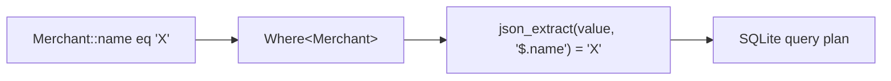

# Querying
{: .no_toc }

1. TOC
{:toc}

Sqkon ships a small, type-safe **Where DSL** that compiles down to SQLite +
JSONB. You write Kotlin against your data classes; Sqkon turns property
references into `json_tree` predicates, binds the values, and lets SQLite plan
the query. There is no string-based query API — if it doesn't compile, it
won't run.

```kotlin
@Serializable
data class Merchant(
    val id: String,
    val name: String,
    val category: String,
    val score: Int = 0,
    val createdAt: Instant = Clock.System.now(),
)

val merchants: KeyValueStorage<Merchant> = sqkon.keyValueStore("merchants")

merchants.select(
    where = Merchant::category eq "Coffee",
).first()
```

Every `select` / `selectAll` returns a `Flow<List<T>>` — the query re-emits
when the rows it depends on change. See the [Flow guide]({{ '/guides/flow/' | relative_url }})
for change-propagation details.

## How a query gets to SQL



A `Where<T>` is a typed AST node. When the store runs a query, every node is
asked to emit a `SqlQuery` — a `FROM` (a `json_tree(entity.value, '$')` join),
a `WHERE` predicate, and the bound parameters. AND/OR combine two child
queries into one. The store also adds the `entity_name = ?` filter for the
store you opened, so two stores in the same database never collide.

## Operator reference

All operators are available as **infix functions on a `KProperty1`** (the
common case — `Merchant::name`) or on a `JsonPathBuilder` (for nested fields,
see [Nested fields]({{ '/guides/nested-fields/' | relative_url }})).

| Operator     | Infix usage                                              | SQL emitted (approx)                                    |
|--------------|----------------------------------------------------------|---------------------------------------------------------|
| `eq`         | `Merchant::name eq "Chipotle"`                           | `... fullkey LIKE '$.name' AND value = ?`               |
| `neq`        | `Merchant::name neq "Chipotle"`                          | `... fullkey LIKE '$.name' AND value != ?`              |
| `inList`     | `Merchant::category inList listOf("Food", "Coffee")`     | `... fullkey LIKE '$.category' AND value IN (?, ?)`     |
| `notInList`  | `Merchant::category.notInList(listOf("Food", "Coffee"))` | `... fullkey LIKE '$.category' AND value NOT IN (?, ?)` |
| `like`       | `Merchant::name like "Chi%"`                             | `... fullkey LIKE '$.name' AND value LIKE ?`            |
| `gt`         | `Merchant::score gt 100`                                 | `... fullkey LIKE '$.score' AND value > ?`              |
| `lt`         | `Merchant::score lt 100`                                 | `... fullkey LIKE '$.score' AND value < ?`              |

That is the full operator surface as of the current release.

{: .note }
> **No `gte`, `lte`, or `between` (yet).** Compose them yourself:
> `(Merchant::score gt 99).or(Merchant::score eq 100)` for `>= 100`, or
> `(Merchant::score gt 99).and(Merchant::score lt 201)` for an exclusive
> 100..200 range. If you'd use these often, an issue/PR is welcome.

### Note on `inList` and `notInList`

The DSL operator is `inList` (not `in`) because `in` is a Kotlin keyword.
`notInList` exists in two forms — infix on a path builder, and a regular
extension on `KProperty1`:

```kotlin
// Infix on a path:
Merchant::id.builder() inList listOf("a", "b")

// Regular call on a property (works for primitives and value classes):
Merchant::name.notInList(listOf("Alice", "Bob"))
```

`notInList(emptyList())` matches **all** rows — there's nothing to exclude.

## Boolean composition: `and`, `or`, `not`

`Where<T>` values combine with two infix functions and one wrapper:

```kotlin
// AND
val byCategoryAndScore =
    (Merchant::category eq "Coffee").and(Merchant::score gt 50)

// OR
val byCategoryOrName =
    (Merchant::category eq "Coffee").or(Merchant::name like "Star%")

// NOT — wraps any Where<T>
val notHidden = not(Merchant::category eq "Hidden")

merchants.select(
    where = byCategoryAndScore.and(notHidden),
).first()
```

`and` and `or` are infix; `not(...)` is a regular function. Each combinator
just nests the SQL — `(A AND B)`, `(A OR B)`, `NOT (A)` — so you can build
arbitrarily deep predicates without any precedence surprises.

{: .highlight }
> Prefer wrapping each operand in parentheses when mixing `and` and `or` —
> Kotlin doesn't give infix functions special precedence, so
> `a or b and c` reads left-to-right as `(a or b) and c`, not `a or (b and c)`.

## Worked examples

These mirror real tests in `KeyValueStorageTest.kt`. The original tests use a
`TestObject` data class with `name`, `description`, `child.createdAt`, and a
`list: List<Child>` — translated below to the `Merchant` shape used in the
docs.

### Equality on a top-level field

```kotlin
val byId = merchants.select(
    where = Merchant::id eq "merchant-42",
).first()
```

Reference test: `select_byEntityId` — `where = TestObject::id eq expect.id`.

### AND of two equality predicates

```kotlin
val coffeeNamedStarbucks = merchants.select(
    where = (Merchant::name eq "Starbucks")
        .and(Merchant::category eq "Coffee"),
).first()
```

Reference test: `select_byAndEntityChildField`.

### OR of two predicates

```kotlin
val hits = merchants.select(
    where = (Merchant::name eq "Starbucks")
        .or(Merchant::name eq "Chipotle"),
).first()
```

### `like` with wildcards

```kotlin
val starsomething = merchants.select(
    where = Merchant::name like "Star%",
).first()
```

`like` accepts the standard SQLite patterns — `%` for any sequence of chars,
`_` for a single char. Bound as a string, so escape your input if it comes
from users.

### `inList` over a list of values

```kotlin
val foodOrCoffee = merchants.select(
    where = Merchant::category inList listOf("Food", "Coffee"),
).first()
```

### `inList` into nested list elements

`inList` works on a path that ends inside a collection — every element gets
checked:

```kotlin
val withTagged = merchants.select(
    where = Merchant::tags.thenList(Tag::name) inList listOf("vegan", "halal"),
).first()
```

(See [Nested fields]({{ '/guides/nested-fields/' | relative_url }}) for `thenList`.)

### Range with `gt` / `lt`

```kotlin
val midRange = merchants.select(
    where = (Merchant::score gt 50).and(Merchant::score lt 200),
).first()
```

## Common pitfalls

### Querying `Instant` (and other non-primitive timestamps)

`Instant`, `LocalDate`, and friends serialize to **ISO-8601 strings** in JSON,
so when you query them you bind a string, not the typed value. Convert with
`.toString()`:

```kotlin
val cutoff = Clock.System.now()

val recent = merchants.select(
    // NOT: ... lt cutoff   — that would bind a non-string and fail
    where = Merchant::createdAt lt cutoff.toString(),
).first()
```

This pattern appears verbatim in `select_byEntityChildField`:

```kotlin
where = TestObject::child.then(TestObjectChild::createdAt) lt expect.child.createdAt.toString()
```

The same applies to `gt`, `eq`, `inList`, and ordering — Sqkon binds whatever
type you give it, and the JSON value is a string.

### Comparing against `null`

`eq` and `neq` accept a nullable value, so null comparison works as you'd
expect:

```kotlin
val withoutDescription = merchants.select(
    where = Merchant::description eq null,
).first()
```

`gt` / `lt` against `null` is a runtime error in SQLite — don't do it.

### Enums

Enums bind by **Kotlin name** (the default `kotlinx.serialization`
representation). `@SerialName` on enum constants is not yet honored at the
binding layer (see the comment in `QueryExt.kt`'s `bindValue`). If you renamed
an enum case with `@SerialName`, query against the original name for now.

### Performance and entity scoping

Each query is automatically scoped to your store's `entity_name`, so two
stores never see each other's rows. JSONB extraction is fast, but un-indexed
range scans on millions of rows are still O(n). See
[Performance]({{ '/guides/performance/' | relative_url }}) for when to add a
generated column / index.

## Where to next

- [Nested fields]({{ '/guides/nested-fields/' | relative_url }}) — query into nested objects and list elements.
- [Ordering]({{ '/guides/ordering/' | relative_url }}) — sort the results once your filter is right.
- [Paging]({{ '/guides/paging/' | relative_url }}) — when the result set gets too big to load at once.
