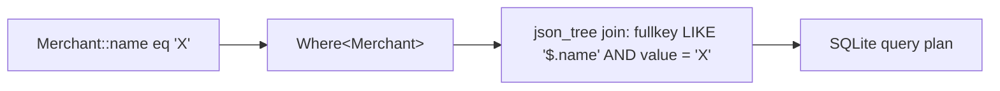

# Querying
{: .no_toc }

1. TOC
{:toc}

Sqkon ships a small, type-safe **Where DSL** that compiles down to SQLite +
JSONB. You write Kotlin against your data classes; Sqkon turns property
references into `json_tree` predicates, binds the values, and lets SQLite plan
the query. There is no string-based query API — if it doesn't compile, it
won't run.

## Quick example

```kotlin
@Serializable
data class Merchant(
    val id: String,
    val name: String,
    val category: String,
    val score: Int = 0,
    val createdAt: Instant = Clock.System.now(),
)

val merchants: KeyValueStorage<Merchant> = sqkon.keyValueStorage("merchants")

merchants.select(
    where = Merchant::category eq "Coffee",
).first()
```

Every `select` / `selectAll` returns a `Flow<List<T>>` — the query re-emits
when the rows it depends on change. See the
[Flow guide]({{ '/guides/flow/' | relative_url }}) for change-propagation
details.

## Operators at a glance

The complete operator surface as of the current release. Click an operator to
jump to its section.

| Operator                                    | What it tests                       |
|---------------------------------------------|-------------------------------------|
| [`eq`](#equality-eq-neq) / [`neq`](#equality-eq-neq) | exact match (also `null`)  |
| [`like`](#string-matching-like)             | SQL `LIKE` pattern                  |
| [`gt`](#numeric-comparison-gt-lt) / [`lt`](#numeric-comparison-gt-lt) | strict greater/less |
| [`inList`](#set-membership-inlist-notinlist) / [`notInList`](#set-membership-inlist-notinlist) | value present in / absent from a list |
| [`and`](#boolean-composition-and-or-not) / [`or`](#boolean-composition-and-or-not) / [`not`](#boolean-composition-and-or-not) | combine other Wheres |
| [`case { … }`](#case--when-per-variant-path-selection) | pick a JSON path per sealed-class variant (CASE/WHEN) |

All operators are available as **infix functions on a `KProperty1`** (the
common case — `Merchant::name`) or on a `JsonPathBuilder` for nested fields
(see [Nested fields]({{ '/guides/nested-fields/' | relative_url }})).

## Equality (`eq`, `neq`)

The simplest predicate: bind a property to a value.

```kotlin
merchants.select(
    where = Merchant::name eq "Chipotle",
).first()
```

`neq` is the inverse:

```kotlin
merchants.select(
    where = Merchant::category neq "Hidden",
).first()
```

### Comparing against `null`

`eq` and `neq` accept a nullable value, so null comparison works as you'd
expect:

```kotlin
val withoutDescription = merchants.select(
    where = Merchant::description eq null,
).first()
```

`gt` / `lt` against `null` is a runtime error in SQLite — don't do it.

## String matching (`like`)

`like` accepts standard SQLite patterns — `%` for any sequence of characters,
`_` for a single character.

```kotlin
val starsomething = merchants.select(
    where = Merchant::name like "Star%",
).first()
```

Bound as a string, so escape your input if it comes from users.

{: .note }
> **Leading wildcards are slow.** `name like '%foo%'` always scans every row
> in the store. Trailing wildcards (`'foo%'`) are cheaper because string
> comparison can short-circuit. See
> [Performance: query planning]({{ '/guides/performance/#query-planning-for-json-paths' | relative_url }}).

## Numeric comparison (`gt`, `lt`)

Strict-inequality operators on a numeric path.

```kotlin
val highScoring = merchants.select(
    where = Merchant::score gt 100,
).first()

val lowScoring = merchants.select(
    where = Merchant::score lt 50,
).first()
```

{: .note }
> **No `gte`, `lte`, or `between` (yet).** Compose them yourself:
> `(Merchant::score gt 99).or(Merchant::score eq 100)` for `>= 100`, or
> `(Merchant::score gt 99).and(Merchant::score lt 201)` for an exclusive
> 100..200 range. If you'd use these often, an issue/PR is welcome.

## Set membership (`inList`, `notInList`)

Test whether a value is present in (or absent from) a collection.

```kotlin
val foodOrCoffee = merchants.select(
    where = Merchant::category inList listOf("Food", "Coffee"),
).first()
```

The DSL operator is `inList` (not `in`) because `in` is a Kotlin keyword.
`notInList` exists in two forms — infix on a path builder, and a regular
extension on `KProperty1`:

```kotlin
// Infix on a path:
Merchant::id.builder() inList listOf("a", "b")

// Regular call on a property (works for primitives and value classes):
Merchant::name.notInList(listOf("Alice", "Bob"))
```

`notInList(emptyList())` matches **all** rows — there's nothing to exclude.

## Boolean composition (`and`, `or`, `not`)

`Where<T>` values combine with two infix functions and one wrapper:

```kotlin
// AND
val byCategoryAndScore =
    (Merchant::category eq "Coffee").and(Merchant::score gt 50)

// OR
val byCategoryOrName =
    (Merchant::category eq "Coffee").or(Merchant::name like "Star%")

// NOT — wraps any Where<T>
val notHidden = not(Merchant::category eq "Hidden")

merchants.select(
    where = byCategoryAndScore.and(notHidden),
).first()
```

`and` and `or` are infix; `not(...)` is a regular function. Each combinator
just nests the SQL — `(A AND B)`, `(A OR B)`, `NOT (A)` — so you can build
arbitrarily deep predicates without precedence surprises.

{: .highlight }
> Prefer wrapping each operand in parentheses when mixing `and` and `or` —
> Kotlin doesn't give infix functions special precedence, so
> `a or b and c` reads left-to-right as `(a or b) and c`, not `a or (b and c)`.

## Nested queries

Every operator that takes a `KProperty1` also accepts a `JsonPathBuilder<T>`,
so the same operators work on nested objects and list elements:

```kotlin
merchants.select(
    where = Merchant::location.then(Location::city) eq "Brooklyn",
).first()
```

The full path-builder reference (chaining, list-element traversal,
`@SerialName` overrides, value classes, sealed classes) lives on its own
page — [Nested fields]({{ '/guides/nested-fields/' | relative_url }}).

## Worked examples

Putting the operators together. These mirror real tests in
`KeyValueStorageTest.kt` (translated from the test's `TestObject` shape into
the `Merchant` shape used elsewhere in the docs).

### AND of two equality predicates

```kotlin
val coffeeNamedStarbucks = merchants.select(
    where = (Merchant::name eq "Starbucks")
        .and(Merchant::category eq "Coffee"),
).first()
```

Reference test: `select_byAndEntityChildField`.

### OR of two predicates

```kotlin
val hits = merchants.select(
    where = (Merchant::name eq "Starbucks")
        .or(Merchant::name eq "Chipotle"),
).first()
```

### Range with `gt` / `lt`

```kotlin
val midRange = merchants.select(
    where = (Merchant::score gt 50).and(Merchant::score lt 200),
).first()
```

### Equality on a top-level field

```kotlin
val byId = merchants.select(
    where = Merchant::id eq "merchant-42",
).first()
```

Reference test: `select_byEntityId`.

## CASE / WHEN: per-variant path selection

Standard operators like `eq` and `gt` match a **single JSON path** against
every row. When the store holds a sealed type and you want a value whose
path differs per variant — for example "the timestamp of whatever happened
to this row" — use a `CaseWhen<T>` expression.

```kotlin
@Serializable
sealed interface Status {
    @Serializable @SerialName("Active")
    data class Active(val activatedAt: Long) : Status
    @Serializable @SerialName("Pending")
    data class Pending(val requestedAt: Long) : Status
}

val effectiveTime: CaseWhen<Status> = Status::class.case {
    whenIs<Status.Active>(Status::class.with(Status.Active::activatedAt))
    whenIs<Status.Pending>(Status::class.with(Status.Pending::requestedAt))
}

val recent = statusStore.select(where = effectiveTime gt 1_700_000_000L).first()
```

`CaseWhen<T>` compiles to a SQL `CASE WHEN … END` over the sealed
discriminator. Each `whenIs<V>` picks the value path used when the row's
discriminator matches `V`'s `@SerialName`. Rows whose variant has no
matching branch fall through to SQL `NULL` — `<op> NULL` is falsy in a
WHERE, so they're filtered out automatically.

`case { … }` is also available on a sealed *property* when the sealed type
is nested inside a larger object:

```kotlin
val time = Account::status.case<Account, Status> {
    whenIs<Status.Active>(Account::status.then(Status.Active::activatedAt))
    whenIs<Status.Pending>(Account::status.then(Status.Pending::requestedAt))
}
```

Operators on `CaseWhen<T>`: `eq`, `neq`, `gt`, `lt`, plus `isNull()` /
`isNotNull()` (handy for selecting rows that fell through every branch).
A `CaseWhen` predicate composes with the json-tree-based operators above
under `and` / `or` exactly like any other `Where<T>`.

For ordering by a `CaseWhen` value, see
[Ordering]({{ '/guides/ordering/' | relative_url }}).

## Common pitfalls

### Querying `Instant` (and other non-primitive timestamps)

`Instant`, `LocalDate`, and friends serialize to **ISO-8601 strings** in JSON,
so when you query them you bind a string, not the typed value. Convert with
`.toString()`:

```kotlin
val cutoff = Clock.System.now()

val recent = merchants.select(
    // NOT: ... lt cutoff   — that would bind a non-string and fail
    where = Merchant::createdAt lt cutoff.toString(),
).first()
```

This pattern appears verbatim in `select_byEntityChildField`:

```kotlin
where = TestObject::child.then(TestObjectChild::createdAt) lt expect.child.createdAt.toString()
```

The same applies to `gt`, `eq`, `inList`, and ordering — Sqkon binds whatever
type you give it, and the JSON value is a string.

### Enums

Enums bind by **Kotlin name** (the default `kotlinx.serialization`
representation). `@SerialName` on enum constants is not yet honored at the
binding layer (see the comment in `QueryExt.kt`'s `bindValue`). If you renamed
an enum case with `@SerialName`, query against the original name for now.

### Performance and entity scoping

Each query is automatically scoped to your store's `entity_name`, so two
stores never see each other's rows. JSONB extraction is fast, but un-indexed
range scans on millions of rows are still O(n). See
[Performance]({{ '/guides/performance/' | relative_url }}) for when to add a
generated column / index.

## Under the hood



A `Where<T>` is a typed AST node. When the store runs a query, every node is
asked to emit a `SqlQuery` — a `FROM` (a `json_tree(entity.value, '$')` join),
a `WHERE` predicate, and the bound parameters. AND/OR combine two child
queries into one. The store also adds the `entity_name = ?` filter for the
store you opened, so two stores in the same database never collide.

For the full read/write lifecycle (serializer → SQLDelight → driver →
SQLite), see
[Concepts: Architecture]({{ '/concepts/architecture/' | relative_url }}).

## Where to next

- [Nested fields]({{ '/guides/nested-fields/' | relative_url }}) — query into nested objects and list elements.
- [Ordering]({{ '/guides/ordering/' | relative_url }}) — sort the results once your filter is right.
- [Paging]({{ '/guides/paging/' | relative_url }}) — when the result set gets too big to load at once.
- [Performance]({{ '/guides/performance/' | relative_url }}) — keep queries cheap as the store grows.
